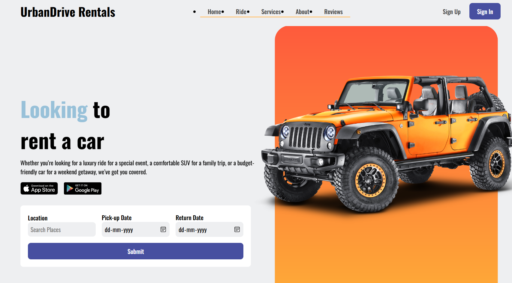
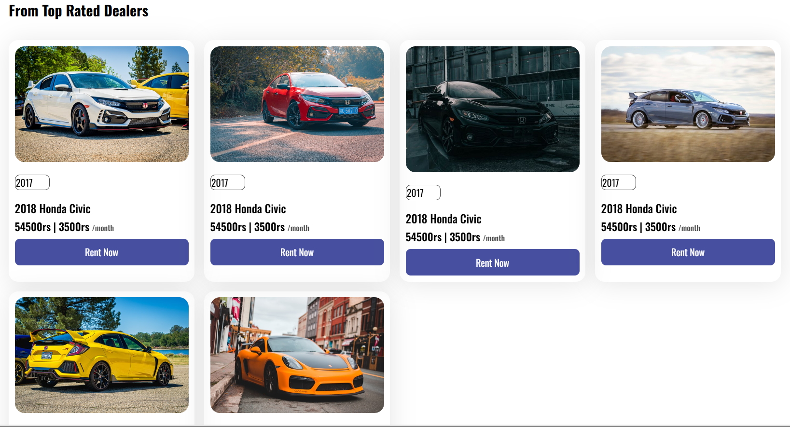
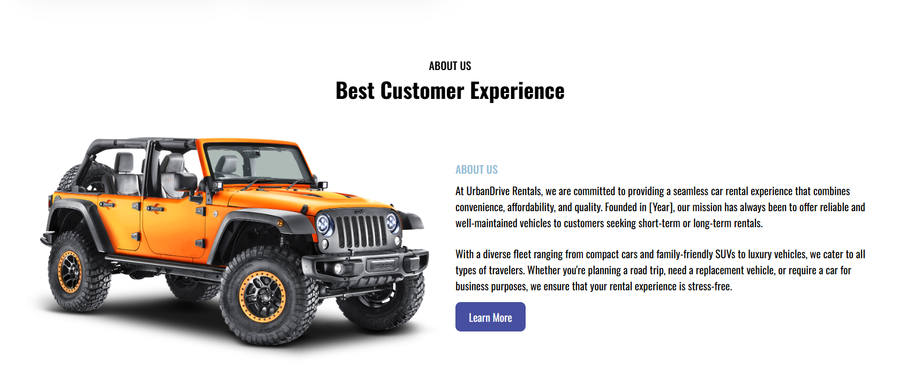

# Car-Rental-Website
UrbanDrive Rentals is a leading online car rental service designed to make your travel experience smooth, convenient, and hassle-free. 
# 🚗 Car Rental Website

A responsive, interactive, and modern car rental landing page designed to provide users with a seamless experience for browsing and booking vehicles online.

---

## ✨ Features

- **Responsive Design**: Adapts perfectly to various screen sizes, from mobile phones to desktops.
- **Interactive Booking Form**: Allows users to choose location, pick-up date, and return date.
- **Dynamic Content Sections**:
  - **How It Works**: A simple 3-step guide to explain the rental process.
  - **Top Deals**: A visual gallery showcasing available cars with pricing and rental details.
  - **About Us**: Highlights the company’s values and customer-first approach.
  - **Customer Reviews**: Showcases testimonials to build credibility and trust.
  - **Newsletter Subscription**: Enables users to subscribe to receive updates via email.
- **Smooth Scroll Animations**: ScrollReveal.js enhances the user interface with subtle animations.
- **Navigation**: Fixed header with smooth scrolling to each section on the page.

---

## 🛠 Technologies Used

- **HTML5** – Structure and semantic content
- **CSS3** – Styling, layout, and media queries for responsiveness
- **JavaScript** – Dynamic behavior and event handling
- **[ScrollReveal.js](https://scrollrevealjs.org/)** – Lightweight animation on scroll
- **[Boxicons](https://boxicons.com/)** – Icon library used across the UI

---

## 🚀 Getting Started

Follow these simple steps to run the project locally.

### ✅ Prerequisites

- A modern web browser like **Google Chrome**, **Firefox**, or **Safari**

### 📦 Installation

1. **Clone the repository**
   ```bash
   git clone https://github.com/deepanshu8560/Car-Rental-Website.git
2. **Navigate to the project directory**
   ```bash
   cd Car-Rental-Website






